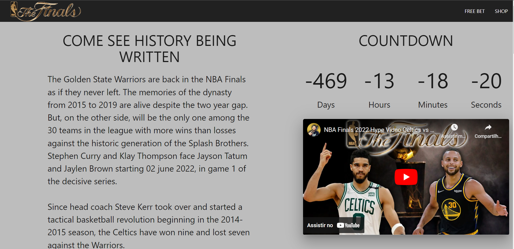

	

	<h1>Personal project with NBA Finals theme</h1>

### What is it? 🤔
NBA Finals themed website for the 2021-2022 season between Golden State Warriors and Boston Celtics. The page has a countdown of the date of game 1 (which in this case has already passed and therefore the negative countdown), has play and stop music functions on the game cards, also has a form integrated with a google spreadsheet and later the function of selecting only 1 card for free bet will be included.

### What technologies were used? 💻
- HTML5
- CSS3
- Javascript

### Is online? 📡
YES! Just [click here](https://nbafinals.netlify.app/) to view the website that is hosted on Netlify servers.

by Murillo Couto 
[GitHub](https://github.com/MurilloCouto)
